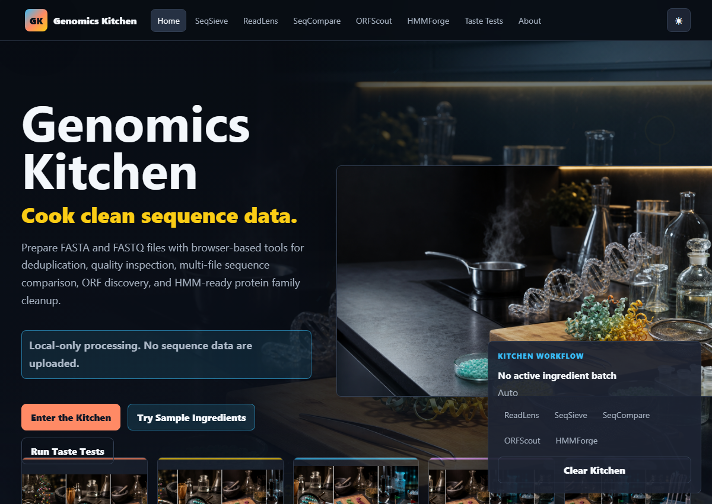
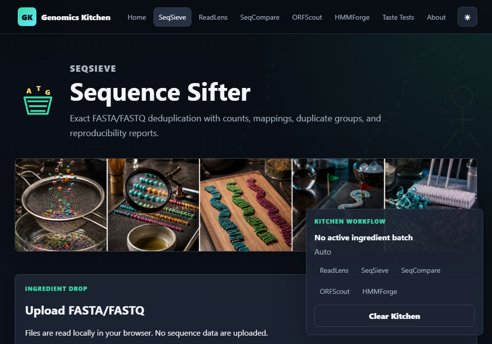
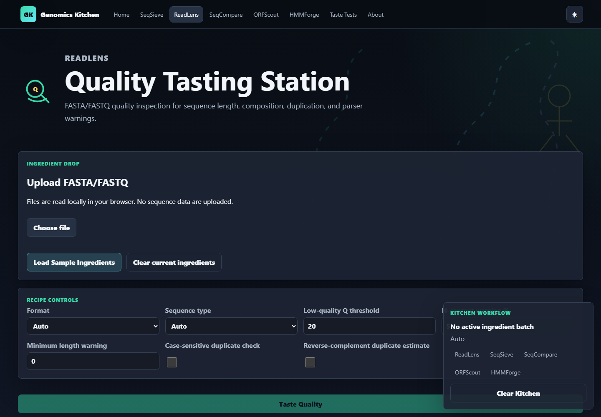
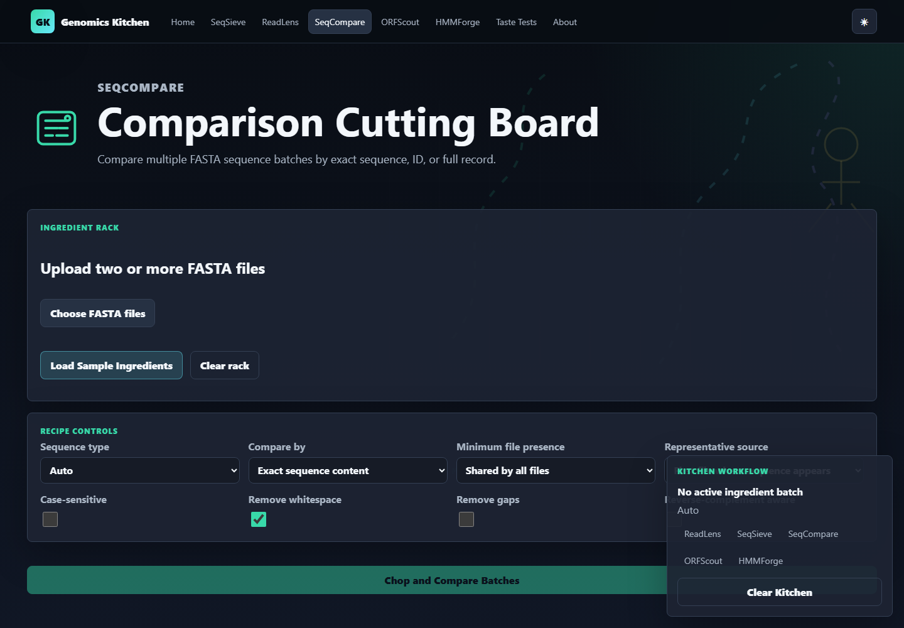
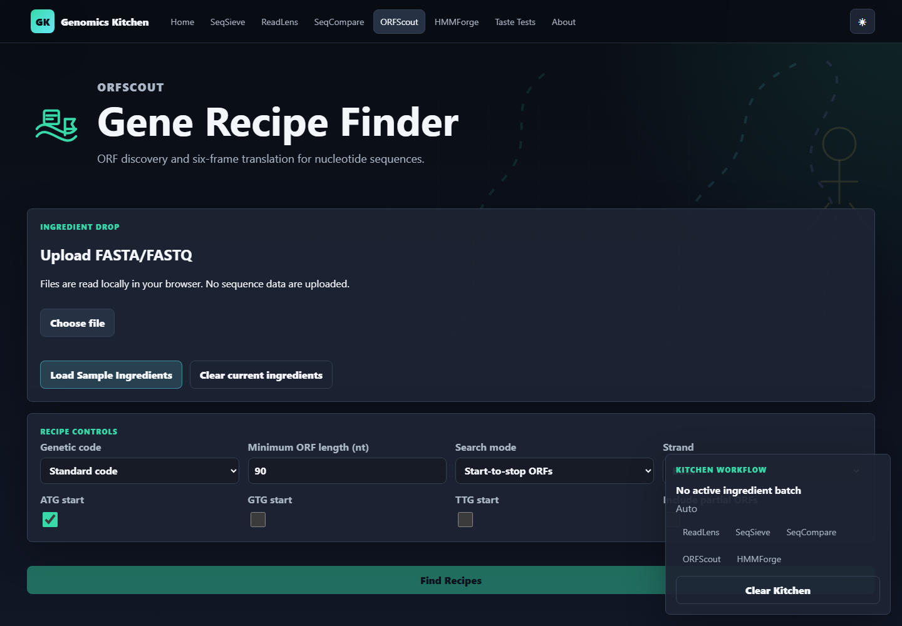
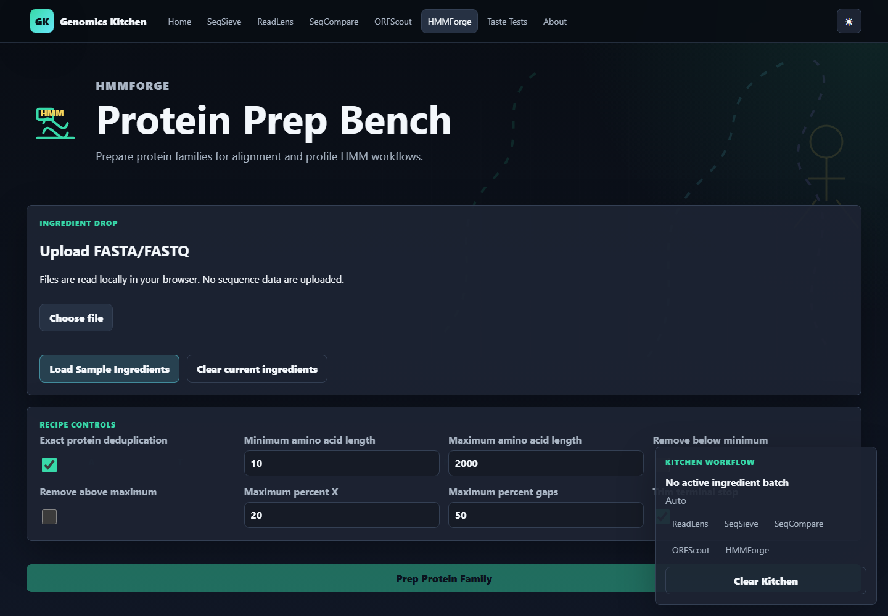

# Introducing Genomics Kitchen: a browser-based toolkit for preparing sequence data

**Author:** Michael Baffour Awuah

Sequence analysis often starts with messy raw files: duplicate records, unclear quality, inconsistent headers, scattered FASTA batches, and protein families that need cleanup before alignment. Genomics Kitchen is a browser-based suite for preparing FASTA and FASTQ data locally.

Files stay in your browser and are not uploaded to a server. Raw sequence ingredients come in; clean, labeled, analysis-ready outputs come out.

Stations include SeqSieve for exact deduplication, ReadLens for QC, SeqCompare for multi-file FASTA comparison, ORFScout for ORF discovery, and HMMForge for protein-family preparation and MAFFT/HMMER command recipes.

## Quick Tutorials

Use SeqSieve to upload a protein FASTA, choose Protein, compare by sequence content, run Sift Sequences, and download deduplicated FASTA, mapping TSV, counts TSV, and report.

Use ReadLens to upload FASTQ, run Taste Quality, review read length, quality, duplicate rate, GC/N content, and export a QC report.

Use SeqCompare to upload three FASTA files, compare by sequence content, review core/accessory/file-specific sets, and export the presence/absence matrix plus core FASTA.

Use ORFScout to upload nucleotide FASTA, select genetic code/start codons/minimum length, run Find Recipes, and export ORF protein FASTA plus the ORF table.

Use HMMForge to upload protein FASTA, deduplicate exact sequences, set filters, review flagged/removed sequences, and export cleaned FASTA plus command recipes.

## Suggested Workflows

- ReadLens -> SeqSieve -> HMMForge
- ORFScout -> HMMForge
- SeqSieve -> SeqCompare
- ReadLens -> SeqSieve

## Screenshots

## Caveats

Exact deduplication is not clustering. ORF prediction is not gene annotation. HMMForge prepares files and command recipes; it does not run HMMER in the browser. FASTQ deduplication can affect abundance interpretation.

Open issues at <https://github.com/mbaffour/genomics-kitchen/issues>.
